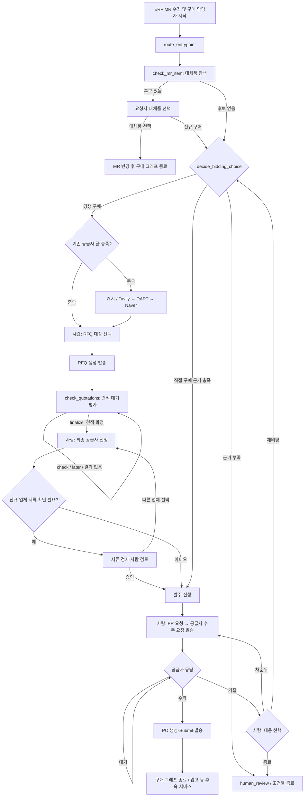
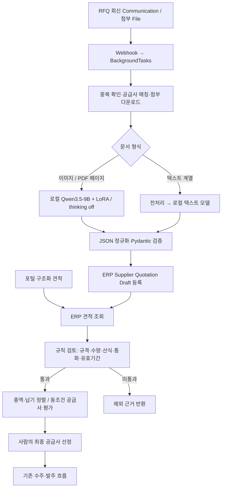
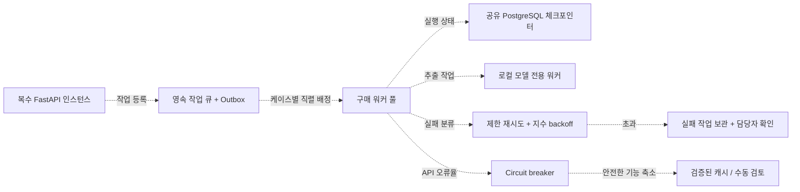

# BiddingFlow AI 시스템 아키텍처

## 최신 반영: 견적서 파인튜닝 및 서비스 연결

2026-09-14 백엔드 `main`의 `0eb062d` 기준이다. `git pull --ff-only`로 원격과 일치함을 확인했다. 파인튜닝 결과 추가(`e59ff4a`)와 추출·평가 경로 변경(`ea16e3f`)을 반영했다. 운영 배포·모델 설치·실제 추론 상태는 확인하지 않았다. 기존 SVG/PNG는 이전 전환 계획을 담고 있으며 이번에는 수정하지 않았다. 최신 구현의 기준은 이 문서의 본문·표·Mermaid다.

| 용도 | 현재 코드의 모델·모드 | 반영 상태 |
|---|---|---|
| 이미지·PDF 견적서 JSON 추출 | `Qwen/Qwen3.5-9B` + `lyc9872/qwen_3.5_9b_peft` LoRA, thinking off | 로컬 추론 연결 코드 반영; CUDA에서 NF4 4bit·double quant 적용 |
| 텍스트 계열 견적 구조화 | `Qwen/Qwen2.5-0.5B-Instruct` 기본값 | 비전 직접 추출과 별도 경로 |
| 견적 평가 | `quotation_reviewer` + `quotation_ranker`, 규칙 기반 | 기존 `sq_evaluation.py` 삭제; 주 그래프 연결 변경 |
| 품목 규격·대체품·외부 공급사 검색 | GPT-4o-mini | Qwen 내부 판단 및 gpt-5.6-luna 검색 전환은 미반영 |

**현재 데이터 흐름:** RFQ 회신 이메일의 Communication/첨부 File Webhook → 첨부 다운로드 → 로컬 추출·JSON 정규화·Pydantic 검증 → ERP Supplier Quotation Draft 등록 → ERP 재조회 → 규칙 검토·정렬 → 사람의 최종 공급사 선정. 포털 견적은 추출 없이 ERP 조회에서 합류한다. Draft 등록 자체가 업무 품질 검토 통과를 뜻하지 않는다.

**실패 처리:** 이메일 경로는 첨부별 실패를 기록하고 일부 성공이면 `partially_processed`, 전부 실패하면 이벤트 실패를 기록한다. 자동 3회 재추출·사람 보정 작업 생성은 이 경로에 없다. 별도 `quotation_pipeline`은 기본 최대 3회 추출 후 `HUMAN_REVIEW` 결과를 반환하며, Excel 추출 실패는 즉시 `EXCLUDED`다. 이메일 경로에 제한 재시도와 사람 보정을 연결하는 것은 후속 과제다.

### 파인튜닝 구성과 평가 결과

학습 계획은 증강 견적서 6,000건에서 내부 검증 100건의 `plan_id`를 제외한 약 5,900건을 사용하는 4-bit QLoRA SFT다. 데이터 구성은 필적 합성 3,600건, 폰트 합성 960건, 컴퓨터 기입본 1,200건, 레이아웃 네거티브 240건이다. Final A 학습 기록은 **2 epoch, 1,476 step** 완료, best checkpoint `checkpoint-1476`, validation loss **0.00713**을 기록한다. 계획서의 LoRA rank·학습률 범위는 확정된 최종 설정으로 간주하지 않는다.

| 내부 검증 지표 | 학습 전 | Final A 학습 후 |
|---|---:|---:|
| JSON 파싱 성공률 | 99% | 100% |
| 동일 13개 필드 정확도 | 65.27% (703/1,077) | **98.51% (1,061/1,077)** |
| 채점 필드 완전일치 문서 | 11/100 | 84/100 |
| 평균 생성 시간 | 4.07초 | 2.98초 |

동일 100장 기준 필드 정확도는 **33.24%p 증가**했다. 비교 보고서와 `notebook_compatible_summary.json` 기준이며, 별도 `summary.json`의 전체 스키마 평가(완전일치율 88%, micro field accuracy 약 99.22%)와 채점 방식이 달라 혼용하지 않는다. 학습 전 FP16, 학습 후 BF16이며 캐시 조건도 달라 시간 차이를 파인튜닝만의 효과로 단정하지 않는다.

검증 문서의 원본 양식·템플릿·필드 소스·작성자가 학습 데이터와 겹치므로 동일 합성 분포 안의 성능이다. 새로운 양식·필체의 실문서와 다품목 전체 행에 대한 독립 평가가 필요하다. 평가 어댑터는 `checkpoint-1476`, 서비스 기본값은 위 Hugging Face 식별자로 기록되어 있으며 두 아티팩트의 동일성·운영 설치 상태는 별도 검증 대상이다. Qwen2.5-VL-7B 학습 완료나 Qwen 내부 판단 통합은 이번 결과에 포함하지 않는다.

---

작성 기준: 2026-09-14 로컬 소스 및 저장소의 학습·평가 기록. 운영 서버의 배포 상태·모델 설치·환경 변수는 확인하지 않았다.

전체 도식: [AI 시스템 아키텍처.svg](./AI_SYSTEM_ARCHITECTURE.svg). 브라우저에서 확대하거나 발표 자료에 삽입할 수 있는 벡터 원본이다.

## 1. 구조와 설계 원칙

BiddingFlow는 ERPNext 구매 데이터를 바탕으로 대체품 탐색, 공급사 발굴, 견적 비교를 수행하고, 사람의 선택과 공급사 응답을 거쳐 발주를 실행하는 구매 지원 시스템이다. React 프론트엔드와 FastAPI 사이에는 구매 작업 API·SSE 알림 경로와 읽기 전용 AI 도우미 API가 있다.

구매 실행은 **LangGraph 상태 기반 오케스트레이션**이다. LLM이 다른 에이전트를 자유롭게 호출하는 구조가 아니라 각 노드가 `Command(update=..., goto=...)`로 상태와 다음 노드를 지정한다. 이 문서의 ‘에이전트’는 역할별 논리 모듈을 뜻하며, 각각 독립 서버나 자율 에이전트로 배포되었다는 의미는 아니다.

범례: 실선 = 현재 연결된 흐름, 주황 = 사람 확인·장애 대응, 점선 = 별도 모듈 또는 확장 제안. 코드에 존재하는 것과 실제 주 경로에서 호출하는 것을 구분한다.

## 2. 에이전트별 역할

| 구성 | 입력 → 출력 | 실행 방식·도구 | 판단/승인 경계 |
|---|---|---|---|
| 구매 오케스트레이터 | MR·사용자 응답 → 상태·다음 노드·대기 작업 | LangGraph, PurchaseProcessState, Command, SQLite 체크포인트 | 규칙 라우팅, interrupt/resume |
| 대체품 탐색 | MR 품목·ERP 품목 정보 → 대체품 후보 | find_substitute, GPT-4o-mini, ERPNext | 요청자가 대체품 또는 신규 구매 선택 |
| 비딩 판정 | 금액·수량·거래 이력·긴급성 → 경쟁 구매/직접 구매 | decide_bidding, 규칙 기반 | 직접 구매 근거 미확보 시 human_review; 긴급 공급사 부재 취소 분기도 존재 |
| 공급사 탐색 | 품목·기존 공급사 → 연락처를 갖춘 후보 | 캐시 → Tavily 구조화 검색 → DART → Naver 보완, GPT-4o-mini | DART 매칭은 신원 확인 근거이며 품질 인증이 아님; 발송 대상은 사람이 선택 |
| RFQ 실행 | 선택 공급사·MR → ERP RFQ·발송 결과 | ERPNext API, 등록·연락처 검증 | 잘못된 선택·연락처·등록 문제는 선택 단계 재진입 |
| 견적서 추출 | RFQ 회신 이미지·PDF → JSON·ERP Draft | Qwen3.5-9B + LoRA, thinking off | 스키마 검증 후 등록; 업무 품질 검토는 ERP 재조회 후 |
| 견적 비교 | RFQ·ERP 견적 → 순위·규격/수량 판단·제외 근거 | quotation_reviewer + quotation_ranker, 규칙 기반 | 단일 견적도 검토; 최종 선정은 사람 |
| 신규 공급사 서류 확인 | 선정 업체·등록 상태·서류 → 검토 작업/승인 상태 | onboarding, inspect/review 노드 | 신규/임시 등록 업체에 조건부 적용 |
| 수주·발주 실행 | 선정 공급사·사용자 PR 요청·공급사 응답 → PO | PR 토큰 응답, ERPNext PO 생성·Submit·메일 | 공급사 수락 후 PO, 거절 시 차순위/재비딩/사람 검토 |
| 읽기 전용 AI 도우미 | 질문·최근 대화 → 조회 답변·사용법·화면 이동 | 모델 계획 → 검증된 조회 필터 → PostgreSQL/FTS/JSON → 답변 | 구매 변경 도구 없음; 사용자별 권한 범위를 조회 계층에서 적용 |
| 품목 규격 지원 | 품목 그룹·규격 → 요구 규격/검증 결과 | item_spec_validation, GPT-4o-mini | 품목 관리 서비스의 별도 기능 |

도우미 모델 이름은 코드 기본값 `gpt-5.6-luna`이며 `ASSISTANT_MODEL`로 변경 가능하다. 이는 설정값을 기록한 것으로 모델의 운영 가용성을 검증한 결과가 아니다.

## 3. 구매 라우팅 상세

위 도식은 주 경로를 요약한다. 유효하지 않은 입력은 동일 노드에서 다시 기다린다. 긴급 직접 구매는 `order_start` 대기를 생략하고 PR 요청 단계로 이동할 수 있다. 진입점에는 비딩 재시작·PR 진입 경로도 있다. `po_approval`은 그래프에 등록되어 있지만 현재 일반 경로에서 이 노드로 향하는 `goto`는 확인되지 않아 필수 승인 단계로 표시하지 않았다.

사람의 입력은 프론트 작업 제출 → API 검증 → `Command(resume=...)` → 해당 체크포인트 재개로 전달된다. SQLite의 `thread_id`는 실행 복구 단위이고, PostgreSQL의 `case_id`는 케이스·작업·알림·이력을 연결하는 식별자다. 이 둘을 일반적인 대화 장단기 메모리로 표현하지 않는다.

## 4. 데이터 흐름과 모델 경계

1. ERPNext의 MR을 Webhook 또는 설정된 polling 방식으로 수집한다. 구매 문서의 원천은 ERPNext이며, 화면 조회용 케이스·작업·알림 등은 PostgreSQL에 투영한다.
2. 구매 시작과 단계별 입력은 FastAPI의 업무 서비스로 전달되고 LangGraph가 ERP 도구·검색 도구·AI 함수를 호출한다. 상태 변경은 DB에 기록되어 API와 SSE를 통해 화면에 반영된다.
3. 공급사 탐색은 정규화 품목명 캐시를 우선 조회한다. 미스 시 Tavily 후보 수집, 중복 제거, DART 기업 매칭 및 홈페이지 연락처 추출, 미확보 후보의 Naver 보완을 수행하고 결과를 캐시에 저장한다. 현재 나라장터 API·별도 DB 후보 수집은 주 검색 경로에서 호출되지 않는다.
4. 주 견적 평가 경로는 `check_quotations → quotation_ranker.evaluate_quotations → review_quotation / rank_quotations`이다. 규격·수량·산식·통화·유효기간 등을 검토하고 통과 견적만 총금액 → 지연일수 → 최종 납기 순으로 정렬한다. 같은 가격·납기 그룹의 모든 후보에 점수가 있을 때만 최근 공급사 평가를 최종 기준으로 사용한다. 평가 없는 업체가 있으면 해당 그룹에는 점수를 사용하지 않는다. 단일 견적도 동일 검토를 거치며 외부 LLM을 호출하지 않는다.
5. RFQ 회신 Communication 또는 첨부 File Webhook은 `quotation_service.register_quotation_email_event`에 연결된다. 첨부를 메모리에 다운로드해 추출·Draft 등록 후 케이스 견적을 갱신한다. 별도 `quotation_pipeline.run_pipeline`도 외부 파일 등록 → ERP 재조회 → 검토·정렬을 제공하지만 이메일 서비스가 이 함수를 호출하는 구조는 아니다.
6. 도우미는 최근 6개 대화 항목과 검색 후보를 이용해 의도를 계획한다. `case_query/case_status`는 권한 제한 DB 조회, `help`는 SQLite FTS5 도움말 검색, `feature_guide`는 JSON 기능 카탈로그로 연결된다. 검색 결과를 바탕으로 답변을 작성한다. 현재 이를 벡터 DB·임베딩 기반 RAG로 표시하지 않는다.

### 견적서 추출·등록·평가 연결

이미지·PDF는 비전 모델이 직접 JSON을 생성한다. `enable_thinking=False`, `do_sample=False`, 기본 출력 제한 512 tokens이며 모델·프로세서·어댑터는 `local_files_only=True`로 로드한다. `HF_QUOTATION_VISION_MODEL`, `HF_QUOTATION_VISION_ADAPTER` 등으로 사전 캐시나 로컬 경로를 지정한다. CUDA에서는 NF4 4bit를 사용하고 CPU에는 해당 양자화 설정을 적용하지 않는다. 모델은 지연 로딩 후 재사용한다.

RFQ 번호와 공급사는 애플리케이션에서 지정한다. 요구값이 추출 결과로 복사되지 않도록 RFQ 규격의 키 이름만 추출기에 전달한다. 추출과 규칙 평가가 로컬에서 이뤄져도 대체품·품목 규격·외부 검색에는 외부 모델 호출이 남아 있으므로 전체 구매 데이터가 내부에서만 처리된다고 표현하지 않는다.

## 5. 장애 대응: 현재 구현

| 상황 | 확인한 대응 | 한계·재개 조건 |
|---|---|---|
| 도우미 모델 계획/답변 실패 | 휴리스틱 의도 분류 + 결정론적 답변 | 도우미 경로에 적용; 구매 AI 전체의 공통 대체 모델은 아님 |
| 도우미 구매 DB 조회 실패 | 조회 불가 안내, 사용법 안내 유지 | 데이터가 없다고 잘못 단정하지 않음 |
| DART에서 매칭·홈페이지·연락처 미확보 | 남은 후보를 Naver 보완 경로로 전달 | 모든 DART 예외를 포괄하는 자동 전환을 의미하지 않음 |
| Tavily 후보 수집 예외 | 빈 후보로 처리하여 후속 흐름 진행 | 후보가 복구되는 대체 검색원은 현재 연결되어 있지 않음 |
| 견적 없음·규칙 검토 미통과 | 빈 순위·제외 근거 반환 → 견적 대기 노드 유지 | 업무 데이터 확인·보정 필요 |
| 이메일 첨부 추출·등록 실패 | 첨부별 실패 기록; 일부 성공은 partially_processed, 전부 실패는 이벤트 실패 | 자동 3회 재추출·사람 보정 작업 생성 없음 |
| 로컬 모델·어댑터 로딩 실패 | 사전 캐시·로컬 경로 확인을 요구하는 오류 | 런타임 다운로드·외부 모델 자동 대체 없음 |
| 공급사 평가 저장소 장애 | 점수 없이 규칙 정렬 지속 | 과거 평가 점수를 적용하지 않음 |
| 별도 quotation_pipeline 추출 실패 | 기본 최대 3회 후 HUMAN_REVIEW; Excel 추출 실패는 즉시 EXCLUDED | 반환 상태이며 사람 작업 자동 생성은 아님; 이메일 경로와 구분 |
| 워크플로 실행 오류 | 실패 상태·체크포인트·재시도 가능 여부 저장 | `snapshot.next` 등 재개 가능 상태에서 복구; 종료된 모든 상태가 자동 재개되지는 않음 |
| ERP polling 일시 실패 | 예외 기록 후 다음 주기 재시도 | Webhook 모드는 시작 시 누락 재조정; 자동 polling 전환과는 다름 |
| 중복 사용자/공급사 응답 | 작업 응답의 원자적 처리, PR 단일 사용 토큰·재전송 방어 | 모든 외부 부작용의 exactly-once 보장을 뜻하지 않음 |
| 공급사 수주 거절 | 차순위 요청 / 재비딩 / human_review 종료 | 구매 담당자가 대응 경로 선택 |

## 6. 확장성과 추가 Fallback 설계 — 제안, 미구현

현재 `workflow_service`의 프로세스 내부 `RLock`과 로컬 SQLite 체크포인트는 수평 확장의 제약이다. 이메일 추출도 FastAPI `BackgroundTasks`와 프로세스 내부 `_EMAIL_EXTRACTION_LOCK`을 사용하며 영속 큐·분산 워커는 아니다. API 프로세스 수만 늘리면 프로세스 간 동시 실행, 체크포인트 접근, polling 중복 문제가 생길 수 있다.

| 확장 항목 | 구체 설계 | 검증 기준 |
|---|---|---|
| 실행·상태 분리 | 영속 큐 + 공유 체크포인터 + 케이스별 분산 잠금/lease; API와 워커 분리 | 동일 케이스 동시 실행 차단, 워커 중단 후 재개 |
| 외부 쓰기 복구 | RFQ/PR/PO별 멱등 키, Outbox, 전송 전후 ERP 결과 조회 | 응답 유실 후 재시도해도 중복 문서·메일 최소화 |
| API 장애 격리 | timeout, 429/일시 5xx 한정 재시도, jitter, circuit breaker; 인증·검증 오류는 수정 작업으로 전환 | 공급자 장애가 전체 작업을 점유하지 않음 |
| 견적 안전 경로 | 기존 스키마 검증·reviewer/ranker를 바탕으로 이메일 제한 재시도·사람 보정 작업 연결 | AI 오류 시 자동 낙찰·발주 금지, 부적합 견적 처리 일관성 |
| 모델 처리량 | 로컬 추출 워커 분리, 모델 상주·동시성 제한, 문서 크기 제한 | GPU 메모리 사용·대기 시간 측정 |
| 검색 확장 | 검색 공급자 어댑터로 나라장터 등 재연결; 캐시 유효기간·출처 표시 | 기존 정답셋으로 후보 정확도·연락처 확보율 비교 |
| 관측·운영 | case_id/thread_id 추적, 노드 지연·실패율·모델 비용·fallback 비율·사람 대기 시간 수집 | 장애 지점과 미처리 작업을 대시보드에서 확인 |

다른 모델로의 자동 전환, 분산 큐, 공통 circuit breaker, 공유 체크포인터, 벡터 DB는 현재 구현 항목으로 표시하지 않는다. 설계 적용 순서는 외부 쓰기 멱등성 확보 → 공유 상태/케이스 잠금 → 큐와 워커 분리 → 모델·검색 자원 독립 확장이 적절하다.

## 7. 소스 근거

백엔드 경로는 `SKN31-FINAL-3Team` 기준, 프론트 경로는 `SKN31-FINAL-front` 기준이다. 오래된 발표용 mmd 및 모듈 README보다 현재 함수 호출을 우선했다.

| 근거 파일 | 확인 항목 |
|---|---|
| `main.py` | FastAPI 라우터, polling/Webhook 모드, 시작 시 재조정 |
| `backend_logic2/workflow/process_graph.py` | 등록 노드·SqliteSaver·상태 로깅 |
| `backend_logic2/workflow/process_commands.py` | goto, interrupt, 직접 구매·수주 응답·PO 경로 |
| `backend_logic2/services/workflow_service.py` | RLock, 실행 실패 저장·재시도·화면 투영 |
| `backend_logic2/nodes/supplier/supplier_search.py` | 캐시·Tavily·DART·Naver 및 비활성 검색원 |
| `backend_logic2/nodes/quotation/quotation_filter/quotation_ranker.py`, `quotation_reviewer.py` | 규칙 검토·정렬·공급사 점수 반영 |
| `backend_logic2/services/quotation_service.py`, `backend_logic2/api/procurement_routes.py` | 이메일 Webhook·첨부 추출·등록·실패 처리 |
| `backend_logic2/nodes/quotation/quotation_filter/quotation_pipeline.py` | 별도 추출 재시도·규칙 검토 파이프라인 |
| `backend_logic2/nodes/quotation/quotation_filter/quotation_extractor.py` | Qwen3.5-9B + PEFT·CUDA 4bit·thinking off·JSON 정규화 |
| `backend_logic2/assistant/service.py`, `adapters/` | 의도 라우팅·읽기 전용 조회·결정론적 fallback·FTS |
| `backend_logic2/repositories/tasks.py`, `backend_logic2/pr/service.py` | 작업 중복 응답 방어·PR 처리 |
| `src/components/assistant/assistantApi.js`, `src/procurement/api/` | 프론트의 도우미·구매 API 연결 |

학습·평가 근거(백엔드 저장소 기준):

- `견적서 학습 데이터/reports/Qwen3.5-9B_견적서_LoRA_파인튜닝_계획서.md`: 데이터 구성·QLoRA 계획.
- `견적서 학습 데이터/reports/Qwen3.5-9B_파인튜닝_전후_비교분석.md`: 학습 전후 지표·평가 조건·일반화 한계.
- `견적서 학습 데이터/finetuning/final_a_trainer_state.json`: 최종 step·epoch·best checkpoint·loss.
- `견적서 학습 데이터/finetuning/results/final_a_1476_batch8/notebook_compatible_summary.json`, `summary.json`: 서로 다른 채점 방식의 평가 원자료.

검증 범위: 소스 호출 관계, 저장된 학습·평가 결과와 본문·Mermaid의 정합성 확인. 기존 SVG/PNG는 갱신하지 않았다. 실제 ERP 호출·메일 발송·모델 추론·장애 주입·운영 부하 테스트는 수행하지 않았다.
